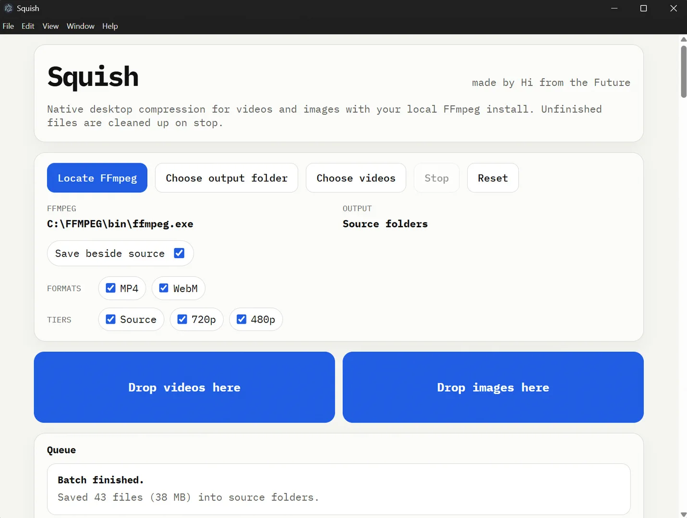

# Squish

Native desktop batch transcoder made by Hi from the Future.

## What it does

- Drag in local video files
- Create 6 outputs per source:
  - `source.mp4`
  - `source.webm`
  - `720p.mp4`
  - `720p.webm`
  - `480p.mp4`
  - `480p.webm`
- Preserve source orientation and aspect ratio inside bounding boxes
- Write finished files directly to disk
- Stop the active transcode and delete the unfinished partial output

## Setup

1. Install Node.js.
2. Run `npm install`.
3. Download an FFmpeg build that includes both `ffmpeg` and `ffprobe`.
4. Run `npm run app`.

To build a Windows portable `.exe`, run `npm run dist:win`.

If `ffmpeg` and `ffprobe` are already on your `PATH`, Squish will detect them automatically on launch.
If not, click `Locate FFmpeg` in the app and choose the `ffmpeg` executable.

## Notes

- This app uses native local FFmpeg, not FFmpeg.wasm.
- Large source files should be much more reliable than the browser version.
- Outputs can be written either into the chosen output folder or beside the original source media, depending on the in-app toggle.

## GitHub Upload

- Do not upload `node_modules`, packaged `.exe` files, or build output folders.
- A repo-level `.gitignore` is included for the common local-only files this project generates.
